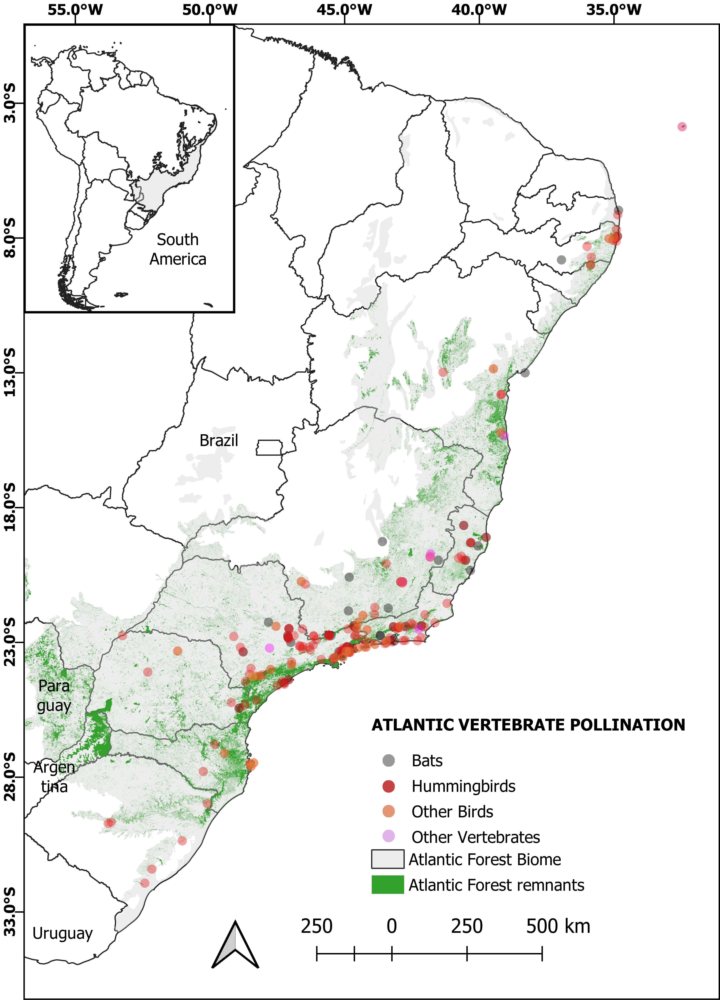

# ATLANTIC POLLINATION

# IAMARA-NOGUEIRA, et al. *ATLANTIC POLLINATION. A Dataset of Flowers and Interaction with Nectar-Feeding Vertebrates from the Atlantic Forest* (in press).

### ATLANTIC-POLLINATION dataset is part of the ATLANTIC SERIES, on which research teams are compiling biodiversity information of Atlantic Forest biome. 

### The datapaper was ACCEPTED in ECOLOGY journal

This dataset provides information about 1902 unique interactions among 515 species of flowering plants and 129 species of potential vertebrate pollinators and the patterns of species diversity across latitudes. We also provide information on the most common plant traits used to understand the interactions between flowers and nectar-feeding vertebrates: plant growth form, corolla length, rate of nectar production per hour in bagged flowers, nectar concentration, flower color and shape, time of anthesis, presence or absence of perceptible fragrance by human, and flowering phenology as well as status of plant’s threat status by IUCN classification. For the vertebrates, status of threat by IUCN classification, body mass, bill or rostrum size are provided. Information on the frequency of visits and pollen deposition on the vertebrate’s body are provided when available on the original source. This dataset represents a notable effort to organize and highlight the importance of vertebrate pollinators on this hotspot of biodiversity on Earth and represents the data currently available.

**The original dataset is fully available at ECOLOGY repository**. 

CONTACT PERSON: Joice Iamara-Nogueira <joice.iamara@alumni.usp.br> and Silvana Buzato <sbuzato@usp.br>

**

**FIGURE 1.** Geographic distribution of the flowers and nectar-feeding vertebrates interaction in the Brazilian Atlantic Forest. 
 
